# Vulnerable-Machine-PwnTillDawn
A comprehensive walkthrough of exploiting the PwnTillDawn vulnerable machine using the 6 Stages of System Hacking.  Successfully compromised the target machine using vsFTPd 2.3.4 backdoor exploit and captured the flag.

## 1: RECONNAISSANCE

### 1.1 Internet Connectivity Test

Before connecting to the PwnTillDawn VPN, a connectivity test was performed to ensure the Kali machine had internet access.

*The `ping google.com` command was executed, and the results show successful replies from Google's server (172.217.27.46). All 5 packets were transmitted and received with 0% packet loss, confirming that the Kali machine has a stable internet connection.*

---

### 1.2 Establishing VPN Connection

After confirming internet connectivity, the OpenVPN connection to PwnTillDawn was initiated using the provided `.ovpn` configuration file.

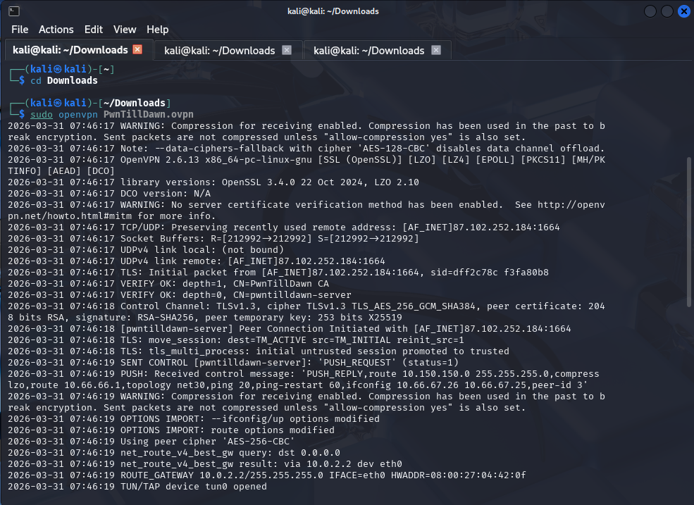

*The command `sudo openvpn PwnTillDawn.ovpn` was executed from the Downloads directory. The output shows a successful TLS handshake and the assignment of a tunnel interface (tun0) with IP `10.66.67.26`. The connection was established to the remote server at `87.102.252.184:1664`, confirming that the Kali machine is now connected to the PwnTillDawn VPN network.*

**Key Details:**
- **VPN Server:** `87.102.252.184:1664`
- **Tunnel IP:** `10.66.67.26`
- **VPN Network:** `10.150.150.0/24`
- **Connection Status:** ✅ Successful

---

### 1.3 Target Discovery

After establishing the VPN connection, a ping test was performed to verify connectivity to the target machine.

*The command `ping 10.150.150.12` was executed. The results show successful replies from the target, with 8 packets transmitted and 8 received (0% packet loss). The response times ranged from 175 ms to 522 ms, confirming that the Kali machine can communicate with the target over the VPN network.*

**Key Observations:**
- **Target IP:** `10.150.150.12`
- **Packet Loss:** 0%
- **Status:** ✅ Reachable

---

## 2: SCANNING

### 2.1 Nmap Port Scan

A comprehensive Nmap scan was performed to identify open ports and running services.

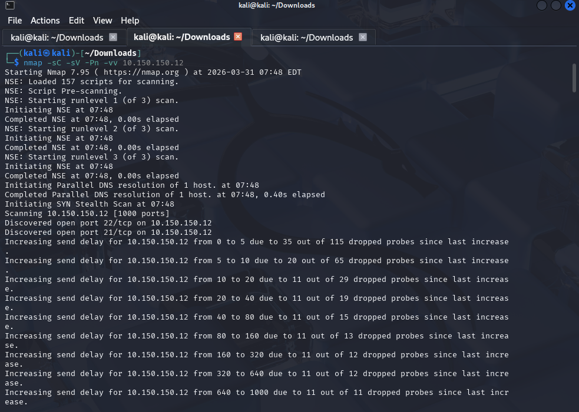

*The command `nmap -sC -sV -Pn -vv 10.150.150.12` was executed.*

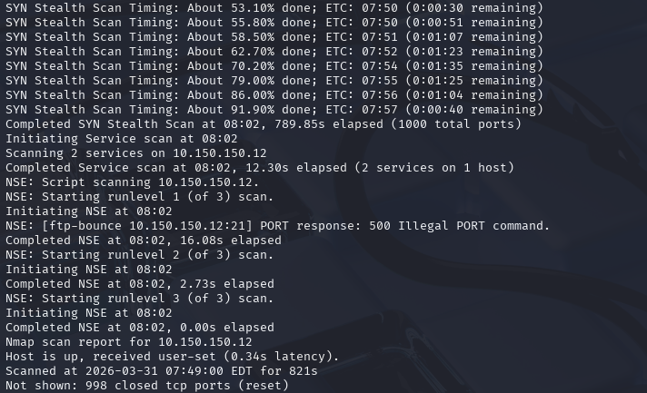

*The scan successfully completed, identifying two open ports.*

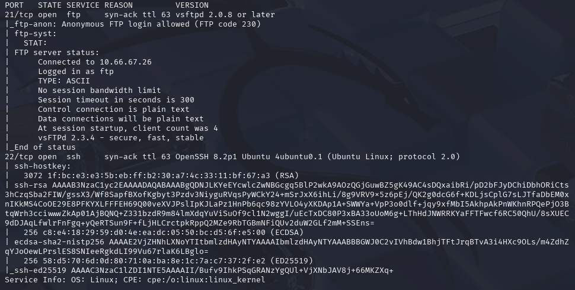

*The scan progressed through all 1000 ports over approximately 13 minutes.*

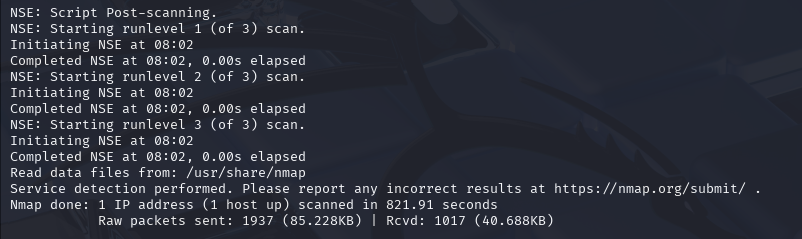

*The Nmap scan revealed the following open ports:*

| Port | Service | Version |
|------|---------|---------|
| **21/tcp** | FTP | vsftpd 2.0.8 or later |
| **22/tcp** | SSH | OpenSSH 8.2p1 Ubuntu |

**Key Findings:**
- **Anonymous FTP Login:** Allowed
- **SSH Version:** OpenSSH 8.2p1 Ubuntu

---

### 2.2 FTP Detailed Vulnerability Scan

A detailed Nmap script scan was performed to gather more information about the FTP service.

*The command `nmap --script=ftp-anon,ftp-bounce,ftp-syst,ftp-vuln-cve* -p 21 -sV 10.150.150.12` was executed.*

**Scan Results:**

| Script | Result |
|--------|--------|
| `ftp-anon` | ✅ Anonymous FTP login allowed |
| `ftp-syst` | Service information retrieved |
| `ftp-bounce` | PORT command rejected |

**FTP Server Information:**

**Key Observations:**
- **FTP Server Version:** vsFTPd 2.3.4
- **Known Vulnerability:** vsftpd 2.3.4 backdoor (CVE-2011-2523)

---

### 2.3 FTP Manual Enumeration

A manual FTP connection was attempted to explore the service.

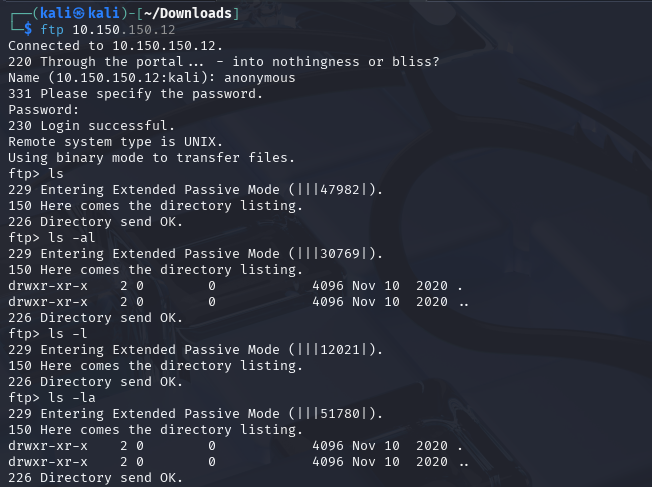

*The command `ftp 10.150.150.12` was executed with username `anonymous`. Login was successful.*

---

## 3: GAINING ACCESS

### 3.1 Metasploit Exploitation

Based on the vsftpd 2.3.4 vulnerability, Metasploit was used to exploit the backdoor.

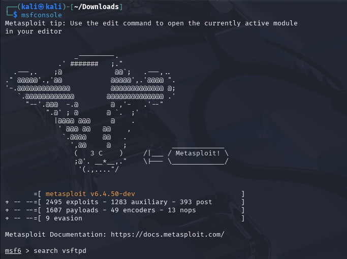

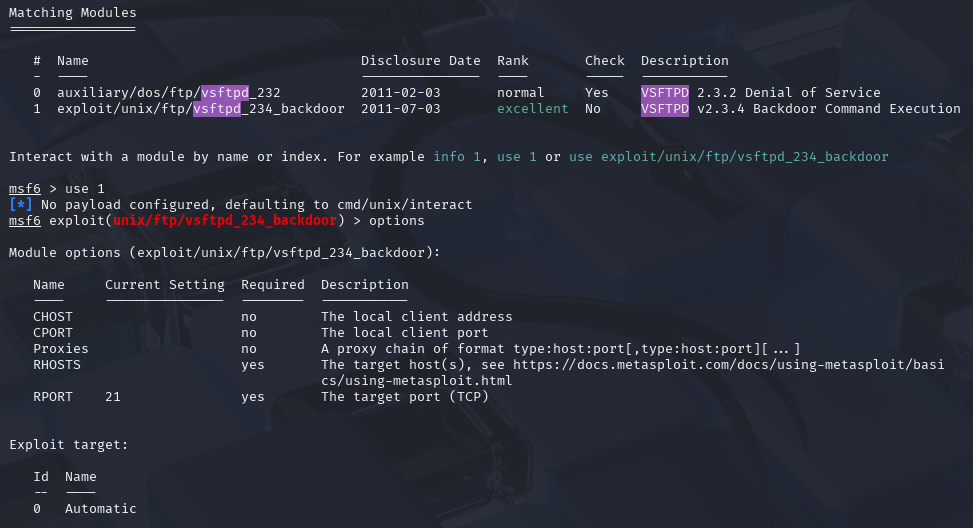

*Metasploit was launched and the module `exploit/unix/ftp/vsftpd_234_backdoor` was selected.*

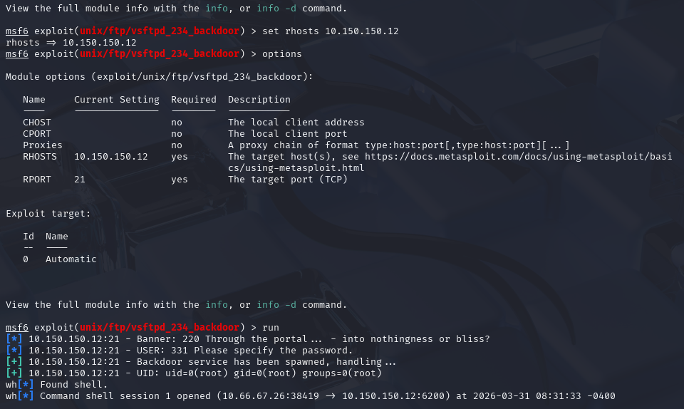

*The RHOSTS parameter was set to `10.150.150.12`. The exploit was executed with the `run` command.*

---

## 4: ESCALATE PRIVILEGES

### 4.1 Root Access Confirmation & Flag Capture

The exploit returned a shell with root privileges immediately. No additional privilege escalation was required.

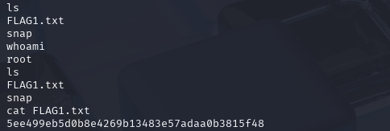

*The `whoami` command confirmed root access. The `ls` command revealed `FLAG1.txt`, and `cat FLAG1.txt` displayed the flag:*

---

## 5: MAINTAIN ACCESS

### 5.1 PwnTillDawn Portal Confirmation

The PwnTillDawn portal was accessed to verify the successful compromise.

*The portal displays the target status as "HAS FALLEN!" with the following details:*

- **Compromised By:** `nininfiyya1310`
- **Date:** 31 March 2026
- **Target IP:** 10.150.150.12

---

### 5.2 Flag Dashboard Confirmation

The flag was also visible in the target dashboard.

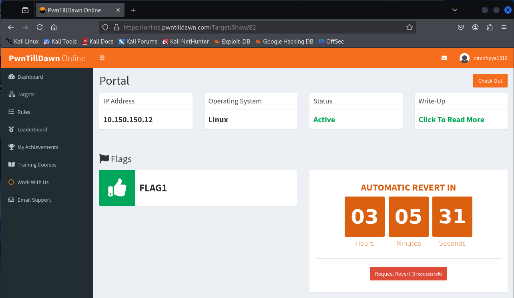

*The dashboard shows FLAG1 has been captured and the target status remains "Active" with an automatic revert timer.*

---

## 6: CLEAR TRACKS

*Note: In the PwnTillDawn environment, clearing tracks is typically not performed as targets are designed for learning and revert automatically.*

The following commands would be used in a real-world scenario:
- `history -c` - Clear command history
- `cat /dev/null > ~/.bash_history` - Clear bash history file

---

## 7: FINAL RESULTS

### Summary of Exploitation

| Stage | Action | Result |
|-------|--------|--------|
| **Reconnaissance** | VPN Connection | ✅ Connected |
| **Reconnaissance** | Target Discovery | ✅ Reachable |
| **Scanning** | Port Scanning | ✅ Ports 21,22 open |
| **Scanning** | FTP Enumeration | ✅ vsftpd 2.3.4 identified |
| **Gaining Access** | Metasploit Exploit | ✅ Backdoor successful |
| **Escalate Privileges** | Root Access | ✅ uid=0 |
| **Maintain Access** | Portal Confirmation | ✅ "HAS FALLEN!" |
| **Final Result** | Flag Capture | ✅ Flag retrieved |

---

### Flags Obtained

| Flag | Value |
|------|-------|
| **FLAG1** | `5ee499eb5d0b8e4269b13483e57ada0b3815f48` |

### Conclusion

The PwnTillDawn target (10.150.150.12) was successfully compromised using the vsftpd 2.3.4 backdoor vulnerability (CVE-2011-2523). Root access was obtained directly through the FTP service, and the flag was captured. The PwnTillDawn portal confirms the compromise with "HAS FALLEN!" status.

**Lab Completed Successfully**
